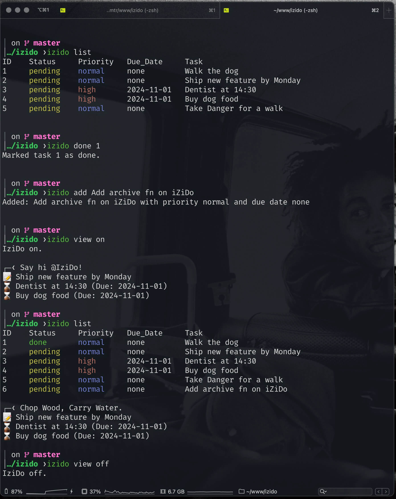

# iZiDo is a Terminal To-Do App with Starship Prompt Integration

Enhance your productivity by managing your tasks directly from the terminal and integrating them into your prompt using the [Starship prompt](https://starship.rs/). This script allows you to add, list, and manage to-do items seamlessly while providing an option to display them in your terminal prompt.

## Table of Contents

- [iZiDo is a Terminal To-Do App with Starship Prompt Integration](#izido-is-a-terminal-to-do-app-with-starship-prompt-integration)
  - [Table of Contents](#table-of-contents)
  - [Features](#features)
  - [Demo](#demo)
  - [Prerequisites](#prerequisites)
  - [Installation](#installation)
    - [1. Clone the Repository](#1-clone-the-repository)
    - [2. Install the Script](#2-install-the-script)
    - [3. Make the Script Executable](#3-make-the-script-executable)
    - [4. Add the Script to Your PATH (Optional)](#4-add-the-script-to-your-path-optional)
    - [5. Set Up the Starship Prompt](#5-set-up-the-starship-prompt)
  - [Usage](#usage)
    - [Add a To-Do Item](#add-a-to-do-item)
    - [List To-Do Items](#list-to-do-items)
    - [Mark a Task as Done](#mark-a-task-as-done)
    - [Remove a To-Do Item](#remove-a-to-do-item)
    - [Clear All To-Do Items](#clear-all-to-do-items)
    - [Toggle To-Do View in Prompt](#toggle-to-do-view-in-prompt)
  - [Customization](#customization)
    - [Adjusting the Script](#adjusting-the-script)
    - [Modifying the Prompt Display](#modifying-the-prompt-display)
  - [Troubleshooting](#troubleshooting)
  - [Origin of the Name](#origin-of-the-name)
    - [**Dialect and Slang Origins**](#dialect-and-slang-origins)
  - [License](#license)
  - [Contributing](#contributing)

---

## Features

- **Add Tasks**: Create new to-do items with optional priority and due dates.
- **List Tasks**: Display all pending and completed tasks with color-coded statuses and priorities.
- **Manage Tasks**: Mark tasks as done, remove tasks, or clear all tasks.
- **Prompt Integration**: Display your pending tasks directly in your terminal prompt using Starship.
- **Toggle View**: Easily enable or disable the to-do display in your prompt.
- **Customization**: Adjust the script and prompt configuration to suit your preferences.
- **Accessible Everywhere**: Use the `izido` command from any directory in your terminal.


## Demo


*Experience the sleek integration of iZiDo with your terminal prompt.*

---

## Prerequisites

- **Bash** or **Zsh** shell.
- [Starship Prompt](https://starship.rs/) installed and configured.
- Terminal emulator capable of displaying Unicode characters and colors.
- **Awk** and **Sed** utilities (commonly pre-installed on Unix systems).

---

## Installation

### 1. Clone the Repository

Clone this repository to your local machine:

```bash
git clone https://github.com/yourusername/izido-terminal-todo-app.git
```

### 2. Install the Script

Navigate to the project directory:

```bash
cd izido-terminal-todo-app
```

Copy the `todo.sh` script to `/usr/local/bin` and rename it to `todo`:

```bash
sudo cp izido.sh /usr/local/bin/izido
```

### 3. Make the Script Executable

Ensure the script has execute permissions:

```bash
sudo chmod +x /usr/local/bin/izido
```

### 4. Add the Script to Your PATH (Optional)

If you prefer to keep the script in a different location, add its directory to your `PATH`:

```bash
export PATH="$PATH:/path/to/izido-terminal-todo-app"
```

Add the above line to your shell configurtion file (`~/.bashrc` or `~/.zshrc`) to make it persistent.

### 5. Set Up the Starship Prompt

Copy the contents of `starship.toml` from the repository to your Starship configuration file:

```bash
cat starship.toml >> ~/.config/starship.toml
```

Alternatively, you can manually merge the configurations if you have existing customizations.

---

## Usage

### Add a To-Do Item

Add a new task with optional priority and due date:

```bash
iZido add -p high -d 2024-11-01 "Go to dentist"
```

- **Priority Options**: `high`, `normal`, `low` (default is `normal`).
- **Due Date Format**: `YYYY-MM-DD`. If omitted, the due date is unspecified.

### List To-Do Items

Display all tasks:

```bash
izido list
```

List tasks filtered by status or priority:

```bash
izido list pending    # List pending tasks
todo list high       # List high-priority tasks
```

### Mark a Task as Done

Mark a task as completed using its ID:

```bash
izido done 1
```

### Remove a To-Do Item

Remove a task using its ID:

```bash
izido remove 2
```

### Clear All To-Do Items

Delete all tasks:

```bash
izido clear
```

### Toggle To-Do View in Prompt

Enable the to-do display in your terminal prompt:

```bash
izido view on
```

Disable the to-do display:

```bash
izido view off
```

---

## Customization

### Adjusting the Script

The `izido` script is customizable. You can modify it to suit your needs:

- **Change Data Storage**: Adjust how tasks are stored (e.g., use JSON or another format).
- **Enhance Functionality**: Add features like task editing, notifications, or integration with other tools.

### Modifying the Prompt Display

Customize how tasks are displayed in your prompt by editing the `starship.toml` configuration:

- **Change Icons**: Replace the Unicode icons with ones you prefer.
- **Adjust Colors**: Modify the color codes to match your terminal theme.
- **Limit Task Display**: Change the number of tasks shown in the prompt.

---

## Troubleshooting

- **Script Not Found**: Ensure `izido` is in your `PATH` and has execute permissions.
- **Prompt Not Updating**: Reload your shell or ensure the `starship.toml` configuration is correct.
- **Permissions Issues**: Use `sudo` cautiously or adjust file permissions as needed.
- **Conflicting Aliases or Functions**: Check for existing aliases or functions named `izido` using `type izido`.

---

## Origin of the Name

**iZiDo** is a playful twist on the phrase **"Easy Do"**, reflecting the application's core mission to simplify task management directly from your terminal. The name embodies the ease and efficiency that iZiDo brings to your daily workflow, making task tracking an effortless part of your coding environment.

### **Dialect and Slang Origins**

The term **"Izi"** is a colloquial contraction of **"easy"** commonly found in various English dialects and informal speech. By adopting this slang variation, **iZiDo** conveys a sense of casual simplicity and approachability, inviting users to integrate task management seamlessly without disrupting their coding flow.

- **"Izi"**: Represents the ease of managing tasks.
- **"Do"**: Emphasizes action and productivity.

Together, **iZiDo** suggests that handling to-dos can be both straightforward and effective, aligning with the application's goal to inspire and streamline your development process.


## License

This project is licensed under the [MIT License](https://mit-license.org/).

---

## Contributing

Contributions are welcome! Please follow these steps:

1. Fork the repository.
2. Create a new branch for your feature or bug fix.
3. Commit your changes with clear messages.
4. Submit a pull request to the `main` branch.

---

**Author**: [IDMTR](https://github.com/idmtr)

---